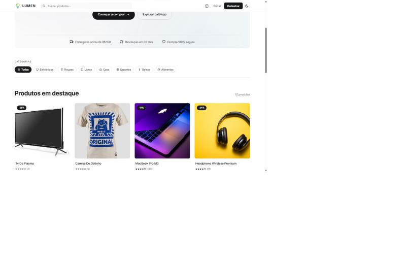
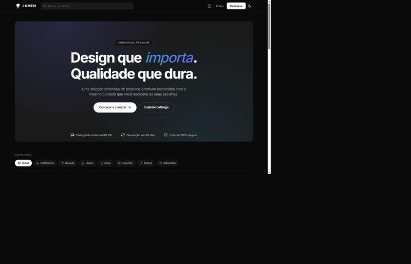
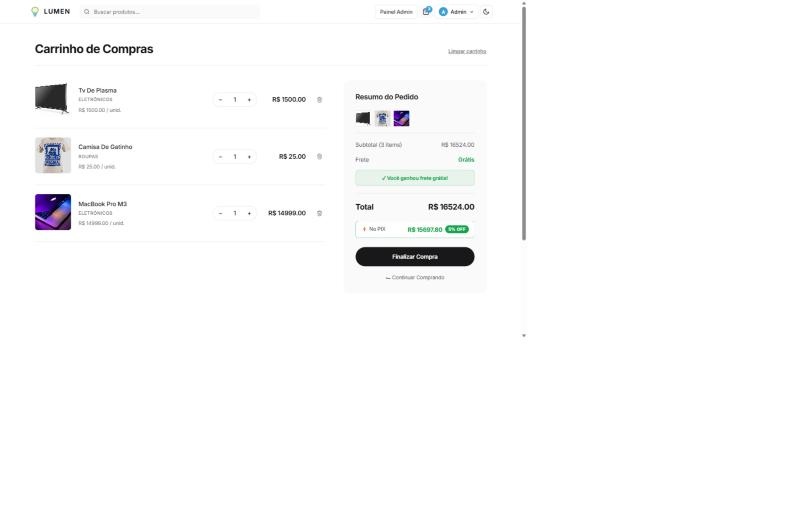
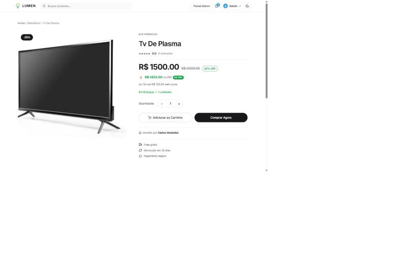
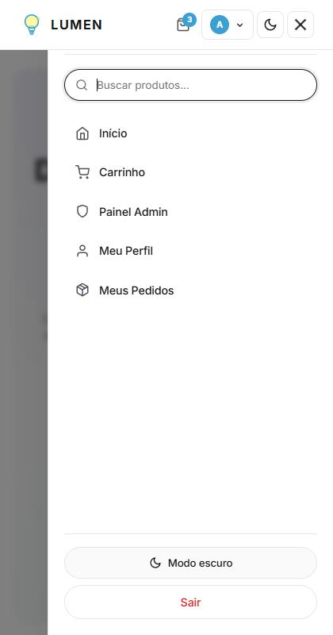
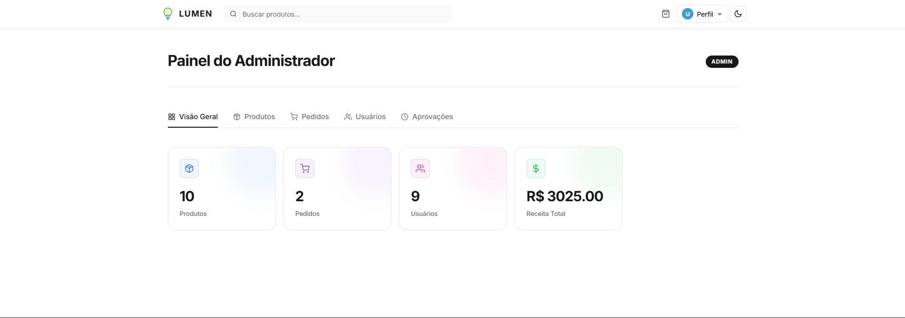
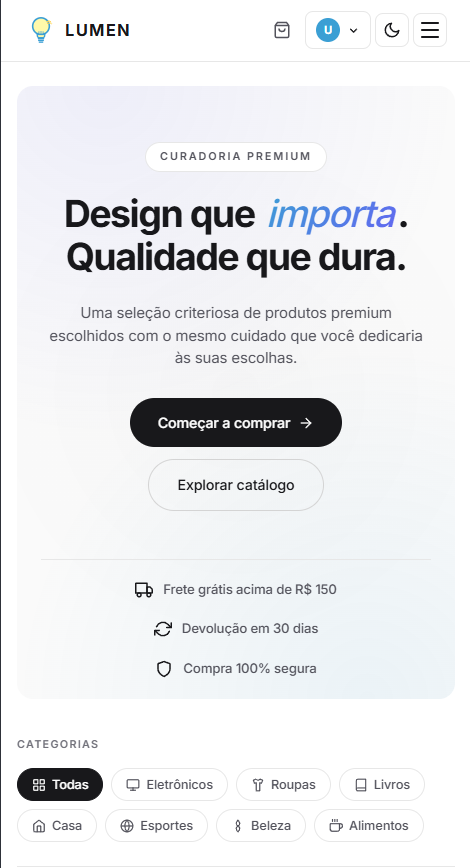

# 💡 LUMEN — E-commerce Premium

> Plataforma de e-commerce full-stack com curadoria premium, design moderno e fluxos completos de compra, venda e administração.

<p align="center">
  
</p>

<p align="center">
  <a href="#-features"><strong>Features</strong></a> ·
  <a href="#-stack"><strong>Stack</strong></a> ·
  <a href="#-rodando-localmente"><strong>Rodar local</strong></a> ·
  <a href="#-contas-de-teste"><strong>Contas teste</strong></a> ·
  <a href="#-screenshots"><strong>Screenshots</strong></a>
</p>

---

## ✨ Features

### 🛍️ Cliente
- **Home com curadoria** — hero gradient, trust strip (frete grátis · devolução · segurança), grid responsivo de produtos
- **Detalhes do produto** — galeria, badge de desconto, preço PIX (5% off), loja física do vendedor com mapa, avaliações
- **Carrinho persistente por usuário** — cada conta tem seu próprio carrinho, mantido entre sessões
- **Checkout em 3 etapas** — endereço com CEP autocompletado (ViaCEP), seleção de pagamento (cartão/PIX/boleto), confirmação com mapa
- **Cartão salvo** — opcional, armazena apenas últimos 4 dígitos + bandeira (nunca PAN ou CVV)
- **Wishlist** — coração no card persiste em localStorage
- **Acompanhamento de pedido** — cancelar (até "processando"), confirmar entrega, solicitar devolução
- **Perfil completo** — endereço com bairro/número/complemento/condomínio, telefone, foto

### 🏪 Vendedor
- **Aprovação por admin** — cadastros de seller ficam pendentes; só vendem após aprovação
- **Dashboard com estatísticas** — produtos ativos, estoque, preço médio
- **CRUD de produtos** — categoria, preço, estoque, descontos, imagens
- **Pedidos da loja** — visualiza apenas pedidos com seus produtos, gerencia status (processando → enviado → devolvido)
- **Loja física pública** — exibida na página dos produtos com mapa geolocalizado

### 👑 Admin
- **Painel completo** — produtos, pedidos, usuários, fila de aprovação de vendedores
- **Stat cards tonais** — indicadores visuais por tom (azul/roxo/rosa/verde) com glow gradient
- **Aprovação de vendedores** — fila de pendências, aprovar/rejeitar com um clique
- **Gestão de roles** — promove/rebaixa entre customer/seller/admin
- **Atualização de pedidos** — qualquer status, override de regras

### 🎨 Design system
- **Tema light/dark** com gradient mesh sutil
- **Inter** com letter-spacing negativo (estilo Linear/Vercel/Stripe)
- **28 ícones SVG inline** herdando cor via `currentColor`
- **Skeleton loaders** com shimmer (substitui spinners)
- **Microinterações** — `translateY(-1px)` no hover, transições com cubic-bezier
- **Mobile menu** slide-in lateral com backdrop blur (estilo iOS)

---

## 🛡️ Segurança

- **Helmet** — headers HTTP de segurança (CSP, X-Frame-Options, etc)
- **Rate limiting** — login (10/15min) e register (5/h) por IP
- **Política de senha** — mínimo 8 chars, com letra + número
- **JWT via Supabase Auth** com verificação a cada request
- **Role-based access control** — middleware `isAdmin` e `isSeller`
- **Whitelist em PUT /profile** — usuário não consegue alterar `role` nem `sellerApplication`
- **Sanitização de query** — search com regex Unicode (anti PostgREST injection)
- **CORS restrito** — origens permitidas via env var
- **Logs sem PII** — apenas `error.name` e mensagem, sem stacks ou request body
- **PCI-safe card storage** — apenas `last4 + brand + holderName + expiry`, nunca PAN ou CVV

---

## 🧱 Stack

**Frontend**
- [React 18](https://react.dev/) + [Vite](https://vitejs.dev/)
- [React Router 6](https://reactrouter.com/)
- [React Leaflet](https://react-leaflet.js.org/) para mapas (Nominatim/OpenStreetMap)
- CSS puro com variáveis (sem Tailwind, sem CSS-in-JS)

**Backend**
- [Node.js](https://nodejs.org/) + [Express](https://expressjs.com/)
- [Supabase](https://supabase.com/) (Auth + Postgres)
- [Helmet](https://helmetjs.github.io/) + [express-rate-limit](https://github.com/express-rate-limit/express-rate-limit)

**Infra / APIs externas**
- [ViaCEP](https://viacep.com.br/) — autocompletar CEP brasileiro
- [Nominatim](https://nominatim.openstreetmap.org/) — geocoding para mapa de entrega

---

## 📁 Estrutura

```
ecommerce/
├── backend/
│   └── src/
│       ├── controllers/      # Lógica de negócio (auth, product, order)
│       ├── routes/           # Endpoints (auth, products, orders, admin)
│       ├── middleware/       # authenticate, isAdmin, isSeller
│       ├── services/         # supabaseClient, mockData
│       └── index.js          # Bootstrap Express
│
├── frontend/
│   └── src/
│       ├── pages/            # Home, ProductDetail, Cart, Checkout, Profile, Dashboards…
│       ├── components/       # Header, Footer, ProductCard, Icon, Skeleton, DeliveryMap
│       ├── context/          # CartContext (per-user)
│       ├── utils/            # formatters, pricing, helpers
│       └── styles/           # CSS por componente
│
├── supabase/
│   └── migrations.sql        # Schema das tabelas (products, profiles, orders)
│
└── docs/
    └── screenshots/          # Imagens do README
```

---

## 🚀 Rodando localmente

### Pré-requisitos
- Node.js 18+
- Conta no [Supabase](https://supabase.com/) (free tier)

### 1. Clone
```bash
git clone https://github.com/RodrigoRuan2/lumen-ecommerce.git
cd lumen-ecommerce
```

### 2. Configure o Supabase
- Crie um projeto novo em [supabase.com/dashboard](https://supabase.com/dashboard)
- No SQL Editor, rode o conteúdo de [`supabase/migrations.sql`](./supabase/migrations.sql)
- Em Project Settings → API, copie:
  - **Project URL**
  - **Anon (public) Key**
  - **Service role Key** ⚠️ secreta

### 3. Backend
```bash
cd backend
npm install
cp .env.example .env
# Edite .env com suas credenciais Supabase
npm run dev
```
API disponível em `http://localhost:5000`.

### 4. Frontend
```bash
cd frontend
npm install
cp .env.example .env
# Edite .env com VITE_SUPABASE_URL e VITE_SUPABASE_ANON_KEY
npm run dev
```
App disponível em `http://localhost:3000`.

---

## 🧪 Contas de teste

> ⚠️ Essas contas existem em ambiente público de demonstração apenas para fins de teste.
> Em produção real, crie sua própria conta via cadastro.

| Papel | Email | Senha |
|-------|-------|-------|
| 👤 **Cliente** | `cliente-teste@lumen.test` | `Senha12345` |
| 🏪 **Vendedor (aprovado)** | `vendedor-teste@lumen.test` | `Senha12345` |
| 👑 **Admin** | `admin-teste@lumen.test` | `Senha12345` |

**Roteiro sugerido para explorar:**

1. **Como Cliente** — adicione produtos ao carrinho, finalize checkout (use endereço fake, cartão `4111 1111 1111 1111`), marque "Salvar cartão"
2. **Como Admin** → aba "Aprovações" — veja a fila de cadastros pendentes de vendedor
3. **Como Vendedor aprovado** → "Minha Loja" → "Loja física" — cadastre um endereço de loja e veja-o aparecer na página dos produtos
4. **Cadastre uma nova conta de vendedor** — observe que o fluxo bloqueia criação de produtos até admin aprovar

---

## 📸 Screenshots

### Home
| Light | Dark |
|-------|------|
|  |  |

### Catálogo de produtos


### Detalhes do produto


### Carrinho


<!--
### Painel do Admin


### Mobile menu
<p align="center">
  
</p>
-->

---

## 📜 Licença

MIT © [Rodrigo Ruan](https://github.com/RodrigoRuan2)

---

<sub>Construído com 💡 como projeto de portfólio. Inspirado em Amazon, Mercado Livre e princípios de design da Apple/Linear/Stripe.</sub>
